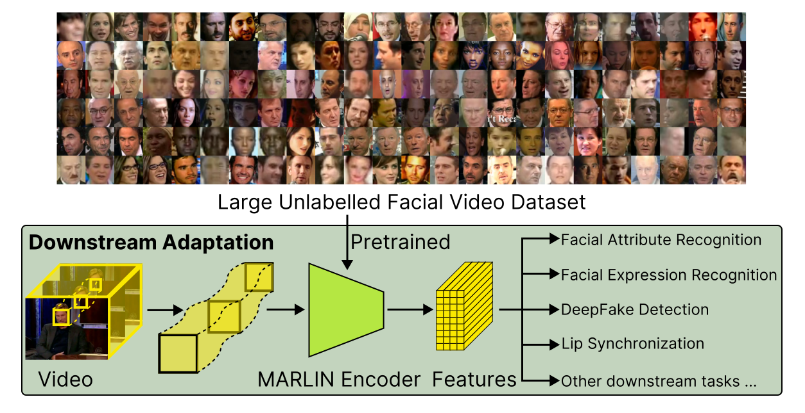

# MARLIN: Masked Autoencoder for facial video Representation LearnINg

<div>
    
    <p></p>
</div>

<div align="center">
    <a href="https://github.com/ControlNet/MARLIN/network/members">
        
    </a>
    <a href="https://github.com/ControlNet/MARLIN/stargazers">
        
    </a>
    <a href="https://github.com/ControlNet/MARLIN/issues">
        
    </a>
    <a href="https://github.com/ControlNet/MARLIN/blob/master/LICENSE">
        
    </a>
    <a href="https://arxiv.org/abs/2211.06627">
        
    </a>
</div>

<div align="center">    
    <a href="https://pypi.org/project/marlin-pytorch/">
        
    </a>
    <a href="https://pypi.org/project/marlin-pytorch/">
        
    </a>
    <a href="https://www.python.org/"></a>
    <a href="https://pytorch.org/"></a>
    <a href="https://github.com/ControlNet/MARLIN/actions"></a>
    <a href="https://github.com/ControlNet/MARLIN/actions"></a>
</div>

This repo is the official PyTorch implementation for the paper 
[MARLIN: Masked Autoencoder for facial video Representation LearnINg](https://arxiv.org/abs/2211.06627).

## Requirements

- Python >= 3.6, < 3.11
- PyTorch >= 1.8
- ffmpeg

## Getting Started

Install from PyPI:
```bash
pip install marlin-pytorch
```

Load MARLIN model from online
```python
from marlin_pytorch import Marlin
# Load MARLIN model from GitHub Release
model = Marlin.from_online()
```

Load MARLIN model from file
```python
from marlin_pytorch import Marlin
# Load MARLIN model from local file
model = Marlin.from_file("path/to/marlin.pt")
```

When MARLIN model is retrieved from GitHub Release, it will be cached in `.marlin`. You can remove marlin cache by
```python
from marlin_pytorch import Marlin
Marlin.clean_cache()
```

Extract features from cropped video file
```python
# Extract features from facial cropped video with size (224x224)
features = model.extract_video("path/to/video.mp4")
print(features.shape)  # torch.Size([T, 768])
```

Extract features from in-the-wild video file
```python
# Extract features from in-the-wild video with various size
features = model.extract_video("path/to/video.mp4", crop_face=True)
print(features.shape)  # torch.Size([T, 768])
```

Extract features from video clip tensor
```python
# Extract features from clip tensor with size (B, 3, 16, 224, 224)
x = ...  # video clip
features = model.extract_features(x)  # torch.Size([B, 1568, 768])
features = model.extract_features(x, keep_seq=False)  # torch.Size([B, 768])
```

## References
If you find this work useful in your research, please cite it.
```bibtex
@article{cai2022marlin,
  title = {MARLIN: Masked Autoencoder for facial video Representation LearnINg},
  author = {Cai, Zhixi and Ghosh, Shreya and Stefanov, Kalin and Dhall, Abhinav and Cai, Jianfei and Rezatofighi, Hamid and Haffari, Reza and Hayat, Munawar},
  journal = {arXiv preprint arXiv:2211.06627},
  year = {2022},
}
```